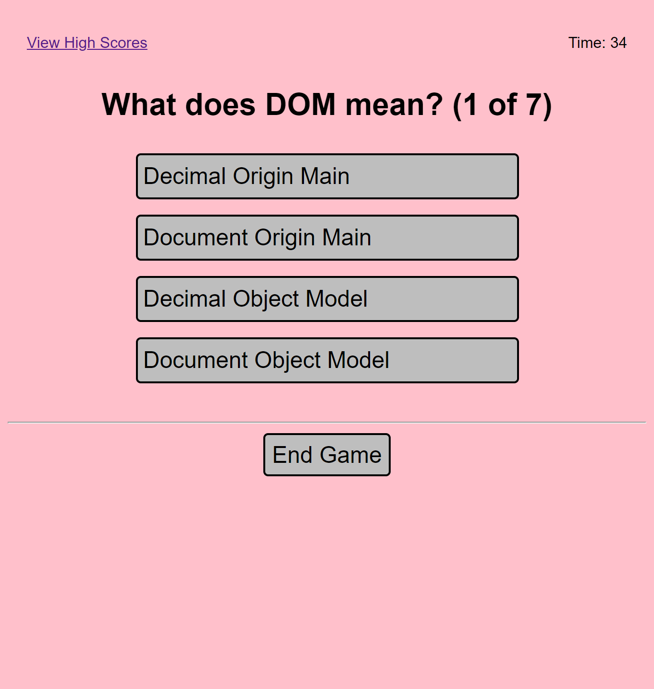

# Code Quiz

## Description

This repository contains a multiple choice quiz about coding. It features HTML, CSS, and JS. It uses arrays, if statements, indexes, a timer with a penalty feature and multiple pages. It will also feature use of local storage as a next step.   

## Usage

This website can be accessed at https://kevinleekwlee.github.io/code-quiz/

Below is a screenshot of the website. 

